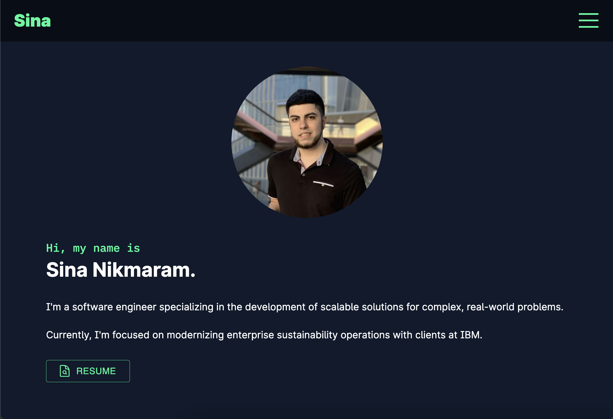

# Sina Nikmaram's Personal Portfolio Website

This repository contains the source code for Sina Nikmaram's personal portfolio website, showcasing his skills, experiences, projects, and contact information.

This website is constantly being updated and improved to better represent Sina's professional accomplishments and interests.

## Table of Contents

1. [Introduction](#introduction)
2. [Getting Started](#getting-started)
3. [Features](#features)
4. [Technologies Used](#technologies-used)
5. [Contact Information](#contact-information)

## Introduction

This website is a platform for showcasing Sina's software engineering skills, work experience, and personal projects. It has been designed with a clean and responsive user interface, making it easy for visitors to navigate and explore Sina's career achievements and interests.

## Getting Started

To run the project locally, follow these steps:

1.  Clone the repository to your local machine:

        git clone https://github.com/BornSina/Personal-Website.git

2.  Navigate to the project folder:

        cd portfolio-website

3.  Install the required dependencies:

        npm install

4.  Start the development server.

        npm run dev

5.  Open your browser and navigate to: http://localhost:3000

## Features

The personal portfolio website includes the following features:

1. **Hero Section:** A welcoming introduction and a brief overview of Sina's professional background, area of expertise, and current focus.

2. **About:** A detailed description of Sina's traits and values which collectively shape my unique approach to problem-solving and driving change.

3. **Timeline:** A reverse-chronological summary of Sina's professional journey and educational background, highlighting key accomplishments

4. **Portfolio:** A grid of software engineering applications, showcasing projects and technologies that Sina has experience with.

## Technologies Used

This website is built using the following technologies:

- HTML
- CSS
- TypeScript
- React
- Next.js
- Mantine
- Material UI
- Docker

## Contact Information

For any inquiries, feel free to reach out to Sina Nikmaram:

- Email: NikmaramCareer@gmail.com
- LinkedIn: https://www.linkedin.com/in/SinaNikmaram
